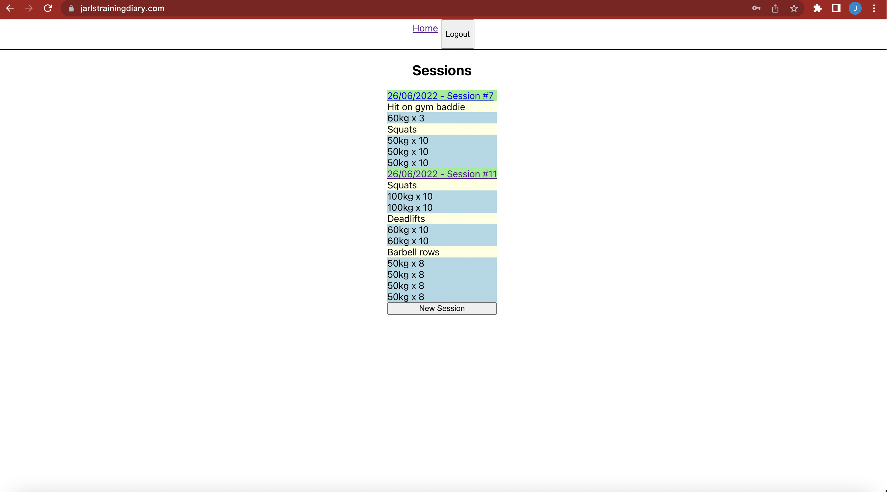

# TrainingDiary frontend

This is the frontend part of the TrainingDiary app. It is coded in React with Typescript and uses Redux. It fetches the data from my backend that is currently not open,
but probably will be. The frontend (i.e. this repo) is hosted on Netflify and
the backend is hosted on a DigitalOcean server.

## Problems/bugs

The following is a list of known problems/bugs that affect the website:

- Currently unknown

## Ideas

The following is a list of ideas that might or might not be implemented:

- Add exercise type (cardio, bodyweight, barbell, dumbbell)
- Add personal exercises
- Add total volume of session
  - Total weight lifted
  - Total number of reps
- Add time session took
  - Need start & finish buttons
  - Could add field where you can type it in
- Make user search case insensitive
- Add statistics for each user per exercise
- Add statistics to each exercise, e.g. how many users have logged it, how many
  sets etc.
- Allow other users (or only followers?) to comment on a session
- See description of an exercise
- Add profile images
- Add images, videos or other media to a session

## Design history

